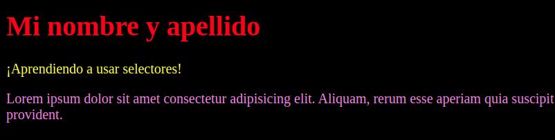

# Actividad de clase
Actividad a desarrollar en clase (10~15 minutos). Compartir el resultado por el canal del curso.

Utilice el explorador de tu preferencia y observa el resultado.
Contarás con 5/10 minutos para realizar la actividad.

### Enunciado:
- Dentro de la carpeta actividad_clase crear un archivo "index.html" con la estructura básica de HTML.
- Agregar una etiqueta de título ```<h1>``` con su nombre y apellido.
- Agrega una etiqueta de span ```<span>``` con un breve texto en linea.
- Agrega una etiqueta de párrafo ```<p>``` con un parrafo de ejemplo (puede aprovechar el atajo de Lorem)
- Crea una carpeta llamada css, y crea dentro de ella un archivo llamado style.css. Vincula tus estilos con el html con la etiqueta ```<link>```.
- Usando el tipo de selector de etiqueta, cambia el color del ```<h1>``` a rojo.
- Usando el tipo de selector de id, cambia el color de ```<span>``` a amarillo.
- Usando el tipo de selector de clase, cambia el color de ```<p>``` a violeta.
- Usando el tipo de selector de etiqueta, cambia el color del fondo del ```<body>``` a rojo.


### Resultado aproximado:

