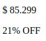

# Tarea

Para esta tarea vamos a poner en práctica los conceptos de selectores de CSS y el concepto de display flex para organizar nuestro layout.

Los pasos que debemos seguir para conseguir esta tarea, serán:

- Generar el HTML pertinente para cada ejemplo
- Generar el CSS pertinente para cada ejemplo
- Tratar de replicar los ejemplos mostrados
- Utilizar las imagenes dentro de images

Finalmente te invitamos a que una vez que lo hallas logrado, dejes volar tu creatividad y generes otros ejemplos por tu cuenta o trates de integrar los ejemplos antes mostrados.

## Ejercicio 1
Para este ejercicio ya cuenta con  el archivo de CSS "style1.css", el cual deberá incluir y llamar en su HTML.\
Debe intentar replicar la siguiente imagen de referencia:


¡Ojo! Debe respectar la estructura HTML que se menciona a continuación para que pueda aplicar luego los estilos.
- Dentro del body generar un "div" que contenerá todo el contenido de la página. Este div debe llevar el id de "main".
- Dentro del "div main" colocar dos etiquetas de parrafo (p), una etiqueta para el precio y una etiqueta para el descuento.
- A la etiqueta de precio debe colocarle la clase "price".
- A la etiqueta de descuento debe colocarle la clase "discount".
- Agregue el texto de precio y descuento dentro de las etiquetas de parrafo.



Una vez concluido el HTML se deberá agregar al CSS el siguiente contenido:
- Utilizando un selector por etiqueta, deberá agregar el siguiente contenido CSS que afecte a la etiqueta "body":
```
  width: 100%;
  height: 100vh;
  display: flex;  
  justify-content: center;
  align-items: center;
```
- Utilizando un selector por id, deberá agregar el siguiente contenido CSS que afecte al id "main":
```
  border-radius: 10px;
  background-color: #222435;
  display: flex;
  flex-direction: column;
  padding: 20px;
  min-width: 250px;
```
- Utilizando un selector por clase, deberá agregar el siguiente contenido CSS que afecte a la clase "price":
```
  font-size: 25px;
```
- Utilizando un selector por clase, deberá agregar el siguiente contenido CSS que afecte a la clase "discount":
```
  color: #2ec4b6;
  font-size: 16px;
```

## Ejercicio 2
Parecido al ejercicio anterior, pero si observa con cuidado verá que ahora en la imagen de referencia el precio y el descuento se encuentran en una misma fila, y se encuentran distribuidos de forma equitativa en el espacio horitonzal.\
Debe intentar replicar la siguiente imagen de referencia:


Para ello deberá agregar una sección más a su HTML. Hasta el moment su HTML del ejercicio anterior se debería ver algo como lo siguiente:
- ```< el div main>```
- ```<p>El precio</p>```
- ```<p>El descuento</p>```
- ```<cierre del div main>```

Ahora deberá agregar un nuevo div con clase "info". Deberá colocar ambas etiquetas de precio y descuento dentro de este div. La estructura debería quedarle algo como la siguiente:
- ```< el div main>```
- ```< el div clase info>```
- ```<p>El precio</p>```
- ```<p>El descuento</p>```
- ```< cierre del div clase info>```
- ```<cierre del div main>```

Luego de completar el HTML, deberá crear un CSS "style2.css" basado en el CSS del ejercicio anterior, y deberá agregarle.
- Agregue estilo para el div info con un selector de clase "info".
- El estilo "info" deberá utilizar display flex.
- El estilo "info" deberá centrar los elementos en el eje vertical (pista --> analice que opción de align-items deberá utilizar).
- El estilo "info" deberá distribuir los elementos de forma equitativa el eje horizontal (pista --> analice que opción de justify-content deberá utilizar).
- El estilo "info" deberá tomar el 100% del ancho (utilice propiedad width).

## Ejercicio 3
Tome el ejercicio anterior y modifique su HTML y CSS para intentar replicar la siguiente imagen de referencia:


Para ello deberá agregar al HTML una etiqueta de imagen que toma la imagen de notebook dentro de la carpeta images. Esta etiqueta deberá estar dentro del "div main" pero fuera del "div info" (justo entre ambos).

Luego de completar el HTML, deberá crear un CSS "style3.css" basado en el CSS del ejercicio anterior, y deberá agregarle.

- Utilizando un selector por etiqueta, deberá agregar el siguiente contenido CSS que afecte a la etiqueta "img":
```
  border-bottom: 1px solid rgba(187, 187, 187, 0.445);
  border-radius: 20px;
  background-color: #edf2f4;
```
