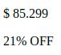

# Ejercicio 1

Para esta tarea vamos a poner en práctica los conceptos de selectores de CSS.

Los pasos que debemos seguir para conseguir esta tarea, serán:

- Generar el HTML pertinente para cada ejemplo
- Generar el CSS pertinente para cada ejemplo
- Tratar de replicar los ejemplos mostrados
- Utilizar las imagenes dentro de images

El ejercicio está dividido en etapas incrementales, deberá ir realizando una por una e incoporar cada cambio solicitado en cada etapa (usar siempre el mismo html y CSS)

Finalmente te invitamos a que una vez que lo hallas logrado, dejes volar tu creatividad y generes otros ejemplos por tu cuenta o trates de integrar los ejemplos antes mostrados.

## Ejercicio 1a
Para este ejercicio ya cuenta con  el archivo de CSS "style1.css", el cual deberá incluir y llamar en su HTML.\
- Crear un HTML ejercicio1.html para resolver lo que se solicita a continuación:

Debe intentar replicar la siguiente imagen de referencia:


¡Ojo! Debe respectar la estructura HTML que se menciona a continuación para que pueda aplicar luego los estilos.
- Dentro del body generar un articulo ```<article>``` que contenerá todo el contenido de la card.
- Dentro del artículo colocar dos etiquetas de parrafo ```<p>```, una etiqueta para el precio y una etiqueta para el descuento.
- A la etiqueta de precio debe colocarle la clase "price".
- A la etiqueta de descuento debe colocarle la clase "discount".
- Agregue el texto de precio y descuento dentro de las etiquetas de parrafo.



Una vez concluido el HTML se deberá agregar al CSS el siguiente contenido:
- Utilizando un selector por etiqueta, deberá agregar el siguiente contenido CSS que afecte a la etiqueta "body":
```
  width: 100%;
```
- Utilizando un selector por etiqueta, deberá agregar el siguiente contenido CSS que afecte a las etiquetas ```<article>```:
```
  width: fit-content;
  margin: 20px;
  padding: 20px;
  border-radius: 10px;
  background-color: #222435;
```
- Utilizando un selector por clase, deberá agregar el siguiente contenido CSS que afecte a la clase "price":
```
  color: #edf2f4;
  font-size: 25px;
```
- Utilizando un selector por clase, deberá agregar el siguiente contenido CSS que afecte a la clase "discount":
```
  color: #2ec4b6;
  font-size: 16px;
```

## Ejercicio 1b
Tome el ejercicio anterior y modifique su HTML y CSS para intentar replicar la siguiente imagen de referencia:


Para ello deberá agregar al HTML una etiqueta de imagen que toma la imagen de notebook dentro de la carpeta images. Esta etiqueta deberá estar dentro del articulo (al comienzo)

- Utilizando un selector por etiqueta, deberá agregar el siguiente contenido CSS que afecte a la etiqueta "img":
```
  border-radius: 20px;
  margin: 5px;
  background-color: #343c8a;
```

## Ejercicio 1c
Tome el ejercicio anterior y modifique su HTML y CSS para intentar replicar la siguiente imagen de referencia:


Dejaremos a su criterio e investigación como agregar ese "botón" verde de "COMPRAR". Puede hacerlo tanto con una etiqueta de ```<div>``` como de ```<button>``` (recomendamos en este caso puntual usar div). Debe buscar:

- Que haya relleno para que el COMPRAR quedé distanciado de los bordes
- Debe buscar que el texto de comprar esté centrado en el medio
- Debe buscar que el color del texto sea blanco y el fondo verde
- Debe buscar que al pasar el mouse por encima cambie el ícono tal como sucede cuando uno pasa el mouse por un link (esto para investigar)
- Debe cambiar el radio del borde para que termine como se ve en la imagen.
